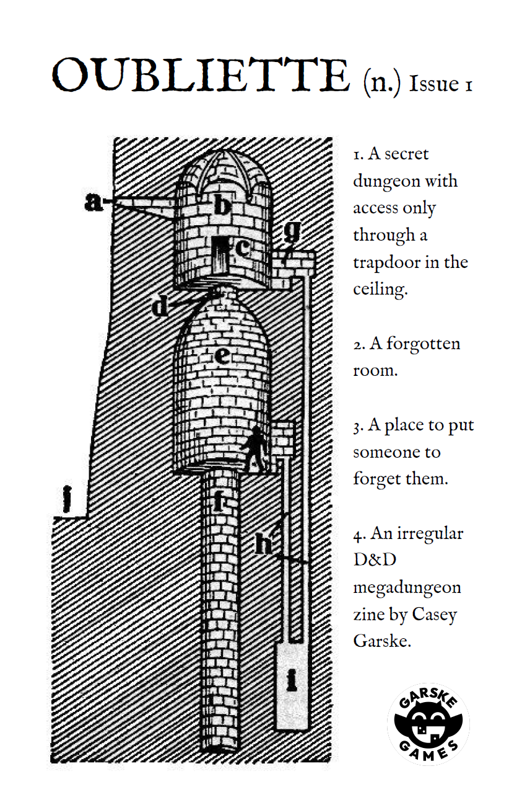

# Oubliette

An [oubliette](https://en.wikipedia.org/wiki/Oubliette) is a secret dungeon whose only entrance is a trapdoor in the ceiling. Once something goes in, it's meant to be forgotten. A fitting name for a storage that locks secrets away in hardware-backed storage.



<sub>Image credit: [idlecartulary.com](https://idlecartulary.com/2025/11/24/bathtub-review-oubliette-n-0-1/)</sub>

| Platform | Backing store |
|----------|--------------|
| iOS | [Keychain Services](https://developer.apple.com/documentation/security/keychain_services) |
| macOS | System Keychain (traditional file-based, no entitlements required) |
| Android | [Android Keystore](https://developer.android.com/training/articles/keystore) (AES-256-GCM) + `SharedPreferences` |


## Quick start

```dart
import 'dart:convert';
import 'dart:typed_data';

import 'package:oubliette/oubliette.dart';

final storage = Oubliette(
  android: const AndroidSecretAccess.onlyUnlocked(strongBox: false),
  darwin: const DarwinSecretAccess.onlyUnlocked(secureEnclave: false),
);

final mnemonic = Uint8List.fromList(utf8.encode('zoo zoo zoo zoo zoo zoo zoo zoo zoo zoo zoo wrong'));
await storage.store('mnemonic', mnemonic);

final transaction = [1, 2, 3, 4, 5]; // some bitcoin transaction bytes

final signature = await storage.useAndForget('mnemonic', (bytes) async {
  final mnemonicWords = utf8.decode(bytes);
  final mnemonic = Mnemonic.fromSentence(mnemonicWords);
  final signature = sign(transaction, mnemonic);
  return signature;
} );
```

> **Recommended defaults:** Use `secureEnclave: true` on Darwin and
> `strongBox: true` on Android for hardware-backed key protection. Note that
> some older or low-end Android devices may not support StrongBox — the plugin
> silently falls back to TEE-backed Keystore when StrongBox is unavailable.
> Call `Keystore().isStrongBoxAvailable()` to check at runtime.

## Key Design Decisions

### Use-and-Forget, Not Read

There is no `read()`. Consumers must use `useAndForget(key, action)`, which retrieves the secret, passes it to a callback, then zeroes the buffer in a `finally` block. The happy path is the secure path.

### No Update — Store and Trash

`store(key, value)` throws if the key already exists. `trash(key)` then `store(key, newValue)`. This eliminates race conditions around partial updates and avoids `SecItemUpdate` silently changing accessibility attributes.

`trash(key)` removes only the stored data — not the underlying cryptographic key. On Android, the encrypted payload is deleted from `SharedPreferences` but the Keystore key is retained. On Darwin, the Keychain item is deleted but the Secure Enclave key pair (when enabled) is retained. On both platforms the cryptographic key is shared across all secrets in a given security profile — deleting it would break every other secret encrypted under the same profile.

### Security Profiles, Not Flags

| Profile | Meaning |
|---------|---------|
| `evenLocked` | Accessible even when the device is locked (after first unlock). |
| `onlyUnlocked` | Accessible only while the device is unlocked. |
| `authenticated` | Requires user authentication (biometric, PIN, pattern, or password). Survives enrollment changes. |
| `authenticatedFatal` | Requires user authentication. Permanently invalidated if biometric enrollment changes. |
| `custom` | Full manual control for advanced use cases. |

Hardware-backing (`strongBox` on Android, `secureEnclave` on Darwin) is always an explicit, required choice — never a hidden default.

### The Key Never Leaves Hardware

On both platforms, the cryptographic key is hardware-bound. On Android the AES-256-GCM key lives in the Keystore (TEE or StrongBox). On iOS/macOS with Secure Enclave enabled, a P-256 key pair is generated inside the SE chip. The private key never enters the application process.

### Versioned Encryption (Android)

Every `EncryptedPayload` carries its scheme version. A future V2 can be introduced without breaking existing data — old payloads continue to decrypt with V1. No migration, ever.

```json
{
  "version": 1,
  "nonce": "base64...",
  "ciphertext": "base64...",
  "aad": "oubliette_my_key",
  "key_alias": "oubliette_only_unlocked"
}
```

The encrypted payload is stored in standard `SharedPreferences` (not `EncryptedSharedPreferences`, which is deprecated). Since the payload is already AES-256-GCM encrypted by the Android Keystore, double-encryption would add complexity without meaningful security benefit.

### No Cloud Sync

On Darwin, `kSecAttrSynchronizable` is explicitly set to `false` on every keychain query. Secrets never leave the device via iCloud Keychain. This is deliberate: mnemonic phrases must remain device-local to prevent cloud-based exfiltration.

### macOS: Two Keychains, Explicit Choice

Legacy file-based keychain (`useDataProtection = false`) works without code signing. Data Protection keychain (`useDataProtection = true`) enables Touch ID/Face ID but requires entitlements. The `authenticated`/`authenticatedFatal` profiles set Data Protection automatically.

### Memory Hygiene at Every Layer

Sensitive buffers are zeroed in Swift (`Data`), Kotlin (`ByteArray`), and Dart (`Uint8List`). This is best-effort. The following sources of residual plaintext are outside our control:

- **GC compaction**: the Dart VM may relocate objects during garbage collection. Previous memory locations retain stale bytes until overwritten.
- **Method Channel buffers**: Flutter's `FlutterStandardTypedData` creates intermediate copies during native-to-Dart serialisation. These buffers are unmodifiable and cannot be zeroed.
- **OS-level leaks**: swap, memory-mapped files, and core dumps may persist plaintext on disk.
- **Compiler dead-store elimination**: in theory the JIT/AOT compiler could optimise away the `fillRange(0)` call, though this is unlikely in practice for `Uint8List`.

These limitations are inherent to managed runtimes. If you need guaranteed memory erasure, a native-only implementation with `mlock` / `SecureZeroMemory` is required.

## Platform requirements

- **Android:** `minSdkVersion` 29+ — required for `setUnlockedDeviceRequired(true)` on `KeyGenParameterSpec`. API 29 guarantees a TEE-backed Keystore on all certified devices. StrongBox (dedicated SE chip) is optional and explicitly requested via the `strongBox` parameter.
- **iOS:** No extra setup.
- **macOS:** No extra setup (traditional keychain, no code signing required).

## Running the example

```bash
cd oubliette/example && flutter run
```

## Integration tests

```bash
cd oubliette/example && flutter test integration_test/
```

## Packages

This repository is a monorepo with three packages:

| Package | Description |
|---------|-------------|
| [`oubliette/`](oubliette/) | Main plugin — platform-agnostic `store`/`useAndForget`/`trash`/`exists` API over `Uint8List` values. Delegates to `keychain` and `keystore` via `default_package`. |
| [`keychain/`](keychain/) | Standalone Flutter plugin wrapping the iOS/macOS Keychain (`SecItem` API). Shared Swift source for both platforms. |
| [`keystore/`](keystore/) | Standalone Flutter plugin wrapping the Android Keystore. Versioned encryption schemes (currently AES-256-GCM v1) with `EncryptedPayload` serialisation. |

`keychain` and `keystore` can be used independently if you only need direct access to the native APIs.

## AI agent guidance

See [AGENT.md](AGENT.md) for constraints that AI coding assistants should follow.
