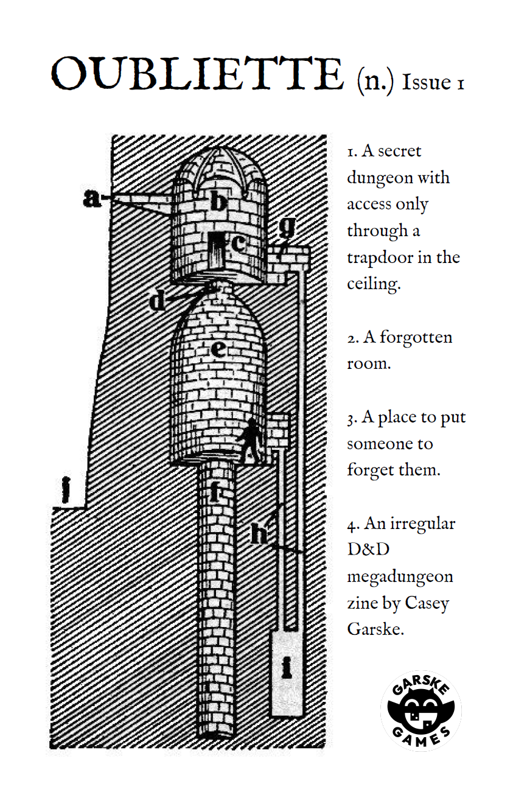

# Oubliette

An [oubliette](https://en.wikipedia.org/wiki/Oubliette) is a secret dungeon whose only entrance is a trapdoor in the ceiling. Once something goes in, it's meant to be forgotten. A fitting name for a storage that locks secrets away in hardware-backed storage.



<sub>Image credit: [idlecartulary.com](https://idlecartulary.com/2025/11/24/bathtub-review-oubliette-n-0-1/)</sub>

| Platform | Backing store |
|----------|--------------|
| iOS | [Keychain Services](https://developer.apple.com/documentation/security/keychain_services) |
| macOS | System Keychain (traditional file-based, no entitlements required) |
| Android | [Android Keystore](https://developer.android.com/training/articles/keystore) (AES-256-GCM) + `SharedPreferences` |


## Quick start

```dart
import 'dart:convert';
import 'dart:typed_data';

import 'package:oubliette/oubliette.dart';

final storage = Oubliette(
  android: const AndroidSecretAccess.onlyUnlocked(strongBox: false),
  darwin: const DarwinSecretAccess.onlyUnlocked(secureEnclave: false),
);

final mnemonic = Uint8List.fromList(utf8.encode('zoo zoo zoo zoo zoo zoo zoo zoo zoo zoo zoo wrong'));
await storage.store('mnemonic', mnemonic);

final transaction = [1, 2, 3, 4, 5]; // some bitcoin transaction bytes

final signature = await storage.useAndForget('mnemonic', (bytes) async {
  final mnemonicWords = utf8.decode(bytes);
  final mnemonic = Mnemonic.fromSentence(mnemonicWords);
  final signature = sign(transaction, mnemonic);
  return signature;
} );
```

> **Recommended defaults:** Use `secureEnclave: true` on Darwin and
> `strongBox: true` on Android for hardware-backed key protection.
>
> StrongBox is **fail-closed**: requesting `strongBox: true` on a device with no
> StrongBox secure element throws `strongbox_unavailable` rather than silently
> downgrading to the TEE. Callers willing to accept TEE must opt in explicitly:
>
> ```dart
> final strongBox = await Keystore().isStrongBoxAvailable();
> final storage = Oubliette(
>   android: AndroidSecretAccess.onlyUnlocked(strongBox: strongBox),
>   darwin: const DarwinSecretAccess.onlyUnlocked(secureEnclave: true),
> );
> ```

## Key Design Decisions

### Use-and-Forget, Not Read

There is no `read()`. Consumers must use `useAndForget(key, action)`, which retrieves the secret, passes it to a callback, then zeroes the buffer in a `finally` block. The happy path is the secure path.

### No Update — Store and Trash

`store(key, value)` throws if the key already exists. `trash(key)` then `store(key, newValue)`. This eliminates race conditions around partial updates and avoids `SecItemUpdate` silently changing accessibility attributes.

`trash(key)` removes only the stored data — not the underlying cryptographic key. On Android, the encrypted payload is deleted from `SharedPreferences` but the Keystore key is retained. On Darwin, the Keychain item is deleted but the Secure Enclave key pair (when enabled) is retained. On both platforms the cryptographic key is shared across all secrets in a given security profile — deleting it would break every other secret encrypted under the same profile.

### Security Profiles, Not Flags

| Profile | Meaning |
|---------|---------|
| `evenLocked` | Accessible even when the device is locked (after first unlock). |
| `onlyUnlocked` | Accessible only while the device is unlocked. |
| `authenticated` | Requires user authentication (biometric, PIN, pattern, or password). Survives enrollment changes. |
| `authenticatedFatal` | Requires user authentication. Permanently invalidated if biometric enrollment changes. |
| `custom` | Full manual control for advanced use cases. |

Hardware-backing (`strongBox` on Android, `secureEnclave` on Darwin) is always an explicit, required choice — never a hidden default.

Each named profile owns a **distinct default storage prefix** (`oubliette_only_unlocked_`, `oubliette_authenticated_`, …). The storage slot key is `prefix + key`, so the same logical key stored under two profiles can never collide — slot isolation is a security boundary, not a convenience. `custom` requires a unique prefix and key alias and rejects any that collide with a reserved profile's.

### Fail-Closed Authentication

Asking for protection and silently getting none is the worst failure mode in a secret store, so every "did the platform actually attach the protection?" question is answered by erroring, never by falling through:

- **Darwin** (`secItemAdd`): if `authenticationRequired` is set but the `SecAccessControl` cannot be created, the item is **not** stored — the call returns an error instead of writing an unprotected item.
- **Android** (`KeyGenParameterSpec`): the authenticated profiles always call `setUserAuthenticationRequired(true)` + `setUserAuthenticationParameters(...)`. This requires API 30 (Android 11), which is the enforced `minSdk` floor — there is no API level on which the requirement is silently dropped.
- **StrongBox**: requesting `strongBox: true` without a StrongBox element throws `strongbox_unavailable` (see Quick start).

### The Stored Blob Is Never Trusted to Decrypt Itself

On Android the encrypted payload lives in attacker-writable `SharedPreferences`. Its `aad` and `key_alias` fields are therefore **verify-only**: on `fetch`, the library recomputes the expected AAD (`prefix + key`) and key alias from the live profile and compares them against the blob. A mismatch — a payload relocated to another slot, or its decrypting key downgraded — throws `PayloadTamperException`. Only the scheme `version` is read from the blob to drive decryption (it must be, to select the scheme); it can never be used to downgrade across schemes that share key material.

### The Key Never Leaves Hardware

On both platforms, the cryptographic key is hardware-bound. On Android the AES-256-GCM key lives in the Keystore (TEE or StrongBox). On iOS/macOS with Secure Enclave enabled, a P-256 key pair is generated inside the SE chip. The private key never enters the application process.

The Secure Enclave key's identity encodes **everything that scopes it** — service, accessibility, and access group — in a single collision-free, length-prefixed tag (`com.oubliette.enclave.…`). Two differently-scoped keys can never share a tag (so `service=nil`, `service=""`, and `service="default"` are all distinct), the SE access-control policy is threaded from the profile's accessibility (not hardcoded), and changing any scoping input regenerates the key rather than silently reusing the old policy.

### One Key per Profile, Hardware-Randomized Nonces

Each security profile uses a single AES-256-GCM key with a fresh hardware-randomized 96-bit nonce per message (`setRandomizedEncryptionRequired(true)`). This is the strongest AEAD the Android Keystore offers. Random-nonce GCM stays safe below ~2³² messages **per key** ([NIST SP 800-38D]); for this library's volume — a handful of secrets per profile, re-encrypted on the rare store/trash/store cycle — that ceiling is never approached.

[NIST SP 800-38D]: https://csrc.nist.gov/pubs/sp/800/38/d/final

### Versioned Encryption (Android)

Every `EncryptedPayload` carries its scheme version. A future V2 can be introduced without breaking existing data — old payloads continue to decrypt with V1. No migration, ever.

```json
{
  "version": 1,
  "nonce": "base64...",
  "ciphertext": "base64...",
  "aad": "oubliette_only_unlocked_my_key",
  "key_alias": "oubliette_only_unlocked"
}
```

`aad` and `key_alias` are persisted for diagnostics and are **verify-only** on
read (see "The Stored Blob Is Never Trusted to Decrypt Itself" above) — they are
never used to choose how the blob is decrypted.

The encrypted payload is stored in standard `SharedPreferences` (not `EncryptedSharedPreferences`, which is deprecated). Since the payload is already AES-256-GCM encrypted by the Android Keystore, double-encryption would add complexity without meaningful security benefit.

### No Cloud Sync

On Darwin, `kSecAttrSynchronizable` is explicitly set to `false` on every keychain query. Secrets never leave the device via iCloud Keychain. This is deliberate: mnemonic phrases must remain device-local to prevent cloud-based exfiltration.

### macOS: Two Keychains, Explicit Choice

Legacy file-based keychain (`useDataProtection = false`) works without code signing. Data Protection keychain (`useDataProtection = true`) enables Touch ID/Face ID but requires entitlements. The `authenticated`/`authenticatedFatal` profiles set Data Protection automatically.

### Memory Hygiene at Every Layer

Sensitive buffers are zeroed in Swift (`Data`), Kotlin (`ByteArray`), and Dart (`Uint8List`). This is best-effort. The following sources of residual plaintext are outside our control:

- **GC compaction**: the Dart VM may relocate objects during garbage collection. Previous memory locations retain stale bytes until overwritten.
- **Method Channel buffers**: Flutter's `FlutterStandardTypedData` creates intermediate copies during native-to-Dart serialisation. These buffers are unmodifiable and cannot be zeroed.
- **OS-level leaks**: swap, memory-mapped files, and core dumps may persist plaintext on disk.
- **Compiler dead-store elimination**: in theory the JIT/AOT compiler could optimise away the `fillRange(0)` call, though this is unlikely in practice for `Uint8List`.

These limitations are inherent to managed runtimes. If you need guaranteed memory erasure, a native-only implementation with `mlock` / `SecureZeroMemory` is required.

`store(key, value)` cannot zero the caller's `value` buffer — the caller owns it and may need it afterwards. The library only wipes the buffers it owns: the native-side copies and the `useAndForget` read buffer.

## Errors

Catchable errors and the recommended caller reaction:

| Error | Layer | Meaning / reaction |
|-------|-------|--------------------|
| `PayloadTamperException` (Dart) | oubliette | Stored blob's slot metadata doesn't match the live profile (relocated/tampered). Do not retry; treat the secret as compromised. |
| `strongbox_unavailable` | keystore | `strongBox: true` requested but StrongBox absent/exhausted. Pre-flight with `isStrongBoxAvailable()` and branch, or surface to the user. |
| `auth_unavailable` (`errSecParam`) | keychain | Auth requested but the access control couldn't be attached — fail-closed. Check device capability/entitlements. |
| `key_not_found` | keystore | Alias has no key. Call `init()` (or rely on the lazy ensure) before use. |
| `key_invalidated` | keystore | Key permanently invalidated (biometric enrollment changed on `authenticatedFatal`). The secret is unrecoverable; re-enroll. |
| `already_exists` | keystore / keychain | A value/key already exists. `trash()` first, or treat as the idempotent success it is during `init()`. |
| `auth_error` / `auth_cancelled` | both | User cancelled or authentication failed. Offer a retry. |

## Platform requirements

- **Android:** `minSdkVersion` **30** (Android 11) — required so `setUserAuthenticationParameters` is always available; on API 29 the authenticated profiles would silently generate a key with no user-auth requirement. Apps using `authenticated`/`authenticatedFatal` profiles must declare `<uses-permission android:name="android.permission.USE_BIOMETRIC" />`. StrongBox (dedicated SE chip) is optional and explicitly requested via the `strongBox` parameter (fail-closed).
- **iOS:** iOS 13+. Apps using `authenticated`/`authenticatedFatal` profiles must add an `NSFaceIDUsageDescription` string to `Info.plist`, or Face ID prompts crash.
- **macOS:** macOS 10.15+. The legacy file-based keychain works with no code signing. The `authenticated`/`authenticatedFatal` profiles use the Data Protection keychain, which requires code signing and the `keychain-access-groups` entitlement.

## Toolchain (reproducible builds)

Downstream wallet pipelines that need reproducible builds should pin to this
matrix. The repo pins what it can; bit-identical output is ultimately the
consuming app's pipeline responsibility.

| Tool | Version | Pinned by |
|------|---------|-----------|
| Flutter | 3.38.5 | `.fvmrc` |
| Dart | bundled with Flutter | (via Flutter pin) |
| AGP | 8.11.1 | `keystore/android/build.gradle`, example |
| Gradle | 8.14 (+ `distributionSha256Sum`) | wrapper `gradle-wrapper.properties` |
| Kotlin | 2.2.20 | `build.gradle` |
| JDK | 17 (vendor per CI) | `compileOptions` / `jvmTarget` |
| Xcode / Swift | Swift 6.0 | document per release (`.xcode-version` recommended) |
| CocoaPods | 1.16.2 | `Podfile.lock` |
| compile SDK / build-tools | 36 / 36.0.0 | `build.gradle` |

NDK is not applicable — this plugin has no native C/C++; the engine's NDK is
fixed by the Flutter version. Runtime deps are kept to official packages only
(`shared_preferences`, `meta`); `dart_mappable` and the `build_runner` codegen
step were removed.

## Running the example

```bash
cd oubliette/example && flutter run
```

## Integration tests

```bash
cd oubliette/example && flutter test integration_test/
```

## Packages

This repository is a monorepo with three packages:

| Package | Description |
|---------|-------------|
| [`oubliette/`](oubliette/) | Main plugin — platform-agnostic `store`/`useAndForget`/`trash`/`exists` API over `Uint8List` values. Delegates to `keychain` and `keystore` via `default_package`. |
| [`keychain/`](keychain/) | Standalone Flutter plugin wrapping the iOS/macOS Keychain (`SecItem` API). Shared Swift source for both platforms. |
| [`keystore/`](keystore/) | Standalone Flutter plugin wrapping the Android Keystore. Versioned encryption schemes (currently AES-256-GCM v1) with `EncryptedPayload` serialisation. |

`keychain` and `keystore` can be used independently if you only need direct access to the native APIs.

## AI agent guidance

See [AGENT.md](AGENT.md) for constraints that AI coding assistants should follow.
